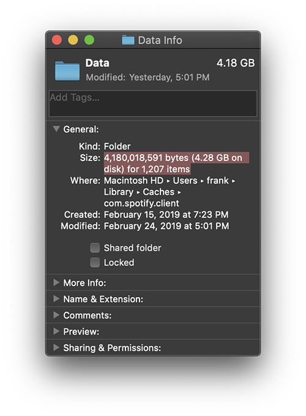
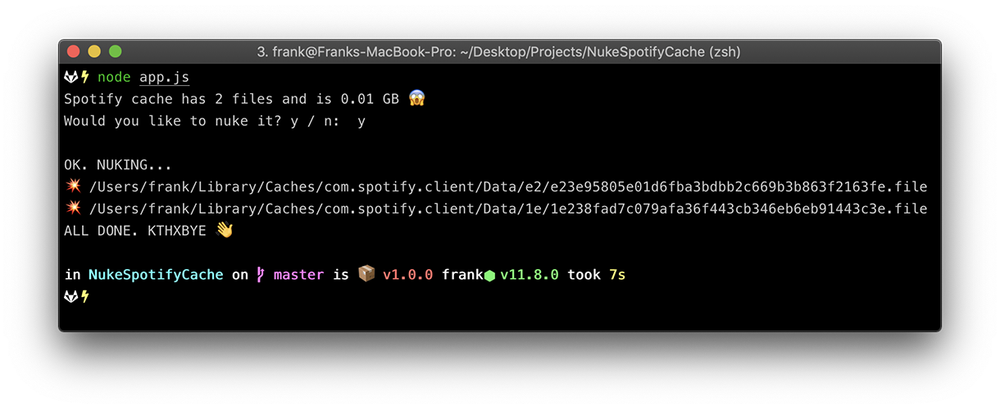

# <a name="0"></a>Spotify Cache Nuker 💥

Ever wonder why your 💻 starts running like 💩 or where all of your hard-drive space went after an extended Spotify listening sesh?

<div align="center">
  
  <p>😱</p>
  <p><strong>Well, wonder no longer! Spotify Cache Nuker to the rescue!</strong></p>
  
  <p><em>Much better!</em></p>
</div>

#### Requirements

[node](https://nodejs.org) (v10)

#### Usage

Clone the repository
```
git clone https://github.com/frankfaustino/SpotifyCacheNuker.git
```

Change directories
```
cd SpotifyCacheNuker
```

Run the app
```
node app.js
```

<hr>

[↑](#0) 👋
